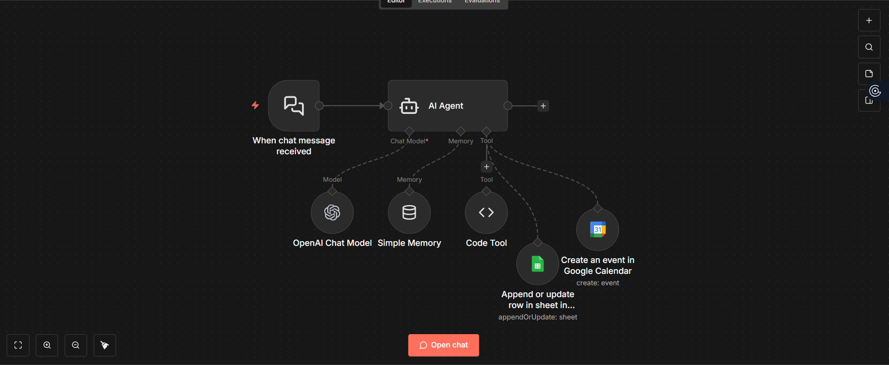
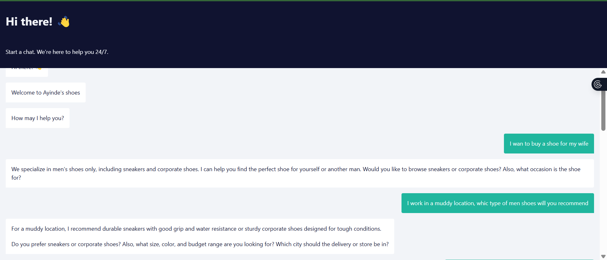
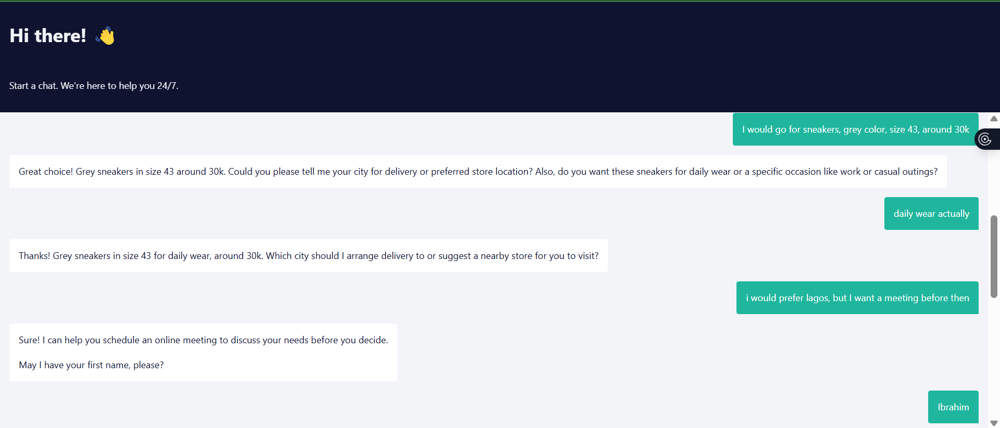
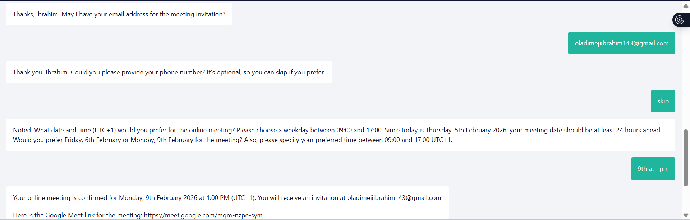
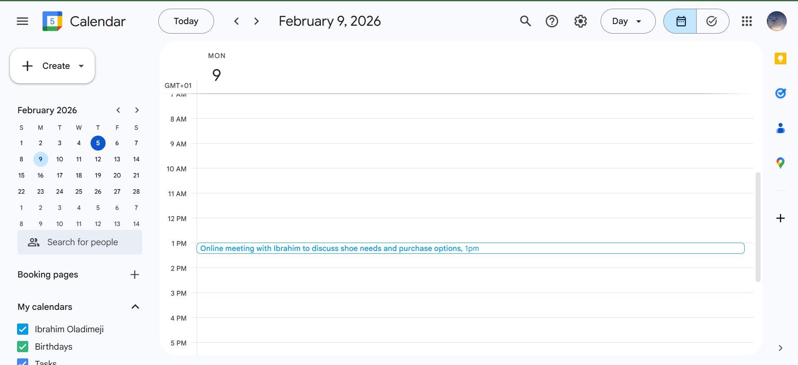

This project is an intelligent concierge system designed to act as a digital front desk for businesses — answering questions, guiding customers, recommending services/products, handling bookings, and managing follow-ups in a seamless flow.

While restaurants are a primary use case, the core system is built to support **any service-based or experience-based business** such as:

- Restaurants & cafés  
- Hotels & short stays  
- Event venues  
- Salons & spas  
- Clinics & service providers  
- Real estate agencies  
- Lifestyle businesses  

The goal isn’t to “add a chatbot.”  
The goal is to solve a real business problem:  

> **How do businesses guide customers from first interaction to conversion while delivering a human-level experience at scale?**

---

## The Problem
Most businesses struggle with:

- Repeated customer questions (menus, pricing, services, hours, availability)
- Customers leaving without booking or converting
- No personalization of recommendations
- Manual handling of DMs, WhatsApp, website chat, and calls
- Missed opportunities due to slow response times
- No structured flow from inquiry → decision → booking → follow-up

For restaurants specifically:
- Customers ask for food recommendations constantly  
- Founders/staff manually respond in DMs  
- Mood, weather, occasion, allergies, and companions are ignored  
- This creates friction and lost conversions  

So the real problem is:
> **How do we turn every customer interaction into a guided, personalized, conversion-focused experience — automatically but naturally?**

---

## What This Concierge System Does

The concierge acts as a smart business assistant that:

### 1. Understands the Customer Context
It dynamically considers:

- Time of day  
- Weather conditions  
- Location (country/state)  
- Mood  
- Occasion (date, birthday, business meeting, casual hangout)  
- Who they are with (partner, friends, family)  
- Preferences and allergies  

---

### 2. Recommends the Best Options
Depending on the business type:

**For restaurants:**
- suggests meals & drinks based on mood + weather + occasion  
- upsells sides, desserts, pairings  
- suggests special experiences (romantic setup, birthday arrangement, private seating)

**For other businesses:**
- recommends services/packages  
- suggests upgrades or add-ons  
- guides customers to the best fit offering  

---

### 3. Answers All Business Questions
The concierge can handle:

- menu/services explanations  
- pricing  
- availability  
- policies  
- business hours  
- promotions  
- location & directions  

All powered by a structured knowledge base (RAG).

---

### 4. Handles Booking & Follow-ups
The flow supports:

- table/service booking  
- reservation confirmations  
- calendar scheduling  
- automated reminders  
- weather-related alerts  
- internal notifications to the business  

---

## Demo Screenshots

---

## System Logic (How It Thinks)

High-level flow:

- **User initiates chat** (website, WhatsApp, Instagram, etc.)
- **Concierge gathers context** (mood, occasion, preferences, constraints)
- **Pulls business knowledge** from structured documents (menus, services, rules)
- **Generates personalized recommendations**
- **Guides toward booking or action**
- **Confirms + follows up automatically**

Optional human-in-the-loop for approvals or high-value cases.

---

## Workflow / Flow Design (High Level)

### Step 1 — Customer Interaction
Customer enters chat and is greeted conversationally.

### Step 2 — Context Discovery
Concierge asks lightweight questions to understand:
- why they’re here  
- what experience they want  
- any constraints  

### Step 3 — Knowledge Retrieval (RAG Layer)
Pulls from:
- menus/services  
- pricing  
- availability rules  
- special offerings  
- business policies  

### Step 4 — Recommendation Engine
Combines:
- user context  
- business data  
- real-world factors (weather/time/occasion)

to suggest the best experience.

### Step 5 — Conversion Flow
- booking
- reservation confirmation
- reminders
- updates to business

---

## Example Restaurant Use Case

A customer messages:

> “I had a long day and want something comforting but not too heavy. It’s raining.”

The concierge:

- factors in mood + weather  
- suggests warm comfort meals  
- recommends a drink pairing  
- offers dessert upsell  
- asks if they’d like a cozy table reserved  

All without staff intervention.

---

## Output & Business Value

For each interaction:

- personalized recommendations  
- increased conversion rates  
- reduced staff workload  
- consistent customer experience  
- faster response times  
- structured booking data  

---

## Why This Matters (The Real Value)

This is not a chatbot.

It’s a **digital concierge layer** that:

- replaces repetitive customer service work  
- increases revenue per customer through smart recommendations  
- creates premium experiences without premium staffing  
- scales across industries with the same core logic  

---

## Optional Advanced Layer — Human Approval + Automation

- Staff can review recommendations or bookings if needed  
- Approved actions are executed automatically  
- Status tracked in dashboards or sheets  

This allows high trust + full automation.

---

## Data Sources for the Knowledge Layer (RAG)

Typical documents include:

- menus / service catalogs  
- pricing sheets  
- availability rules  
- promotions  
- FAQs  
- business policies  
- special experience options  

---

## Future Enhancements

- CRM integration  
- loyalty tracking  
- customer preference memory  
- multi-location support  
- revenue analytics per recommendation  
- A/B testing of recommendation strategies  

---

## Tech (Implementation Detail)

Built as a modular concierge system using:

- conversational AI  
- retrieval-augmented knowledge base  
- workflow automation  
- booking & notification logic  

(Tooling can change — the architecture remains.)

---

## Core Philosophy

We don’t automate conversations.  
We design **guided customer experiences that convert.**

---
